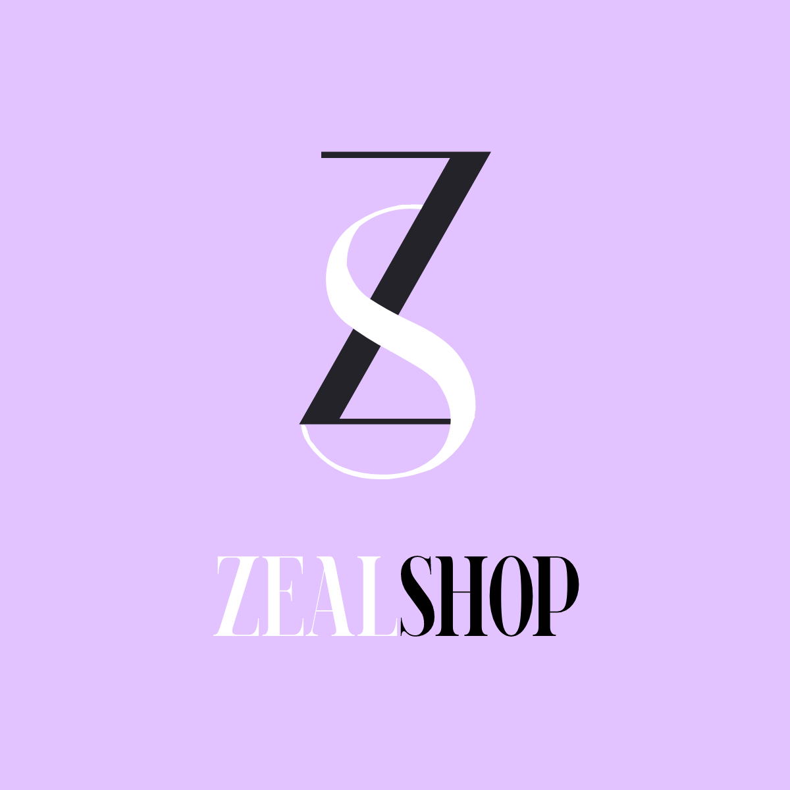
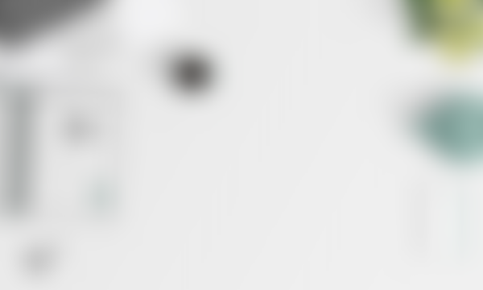
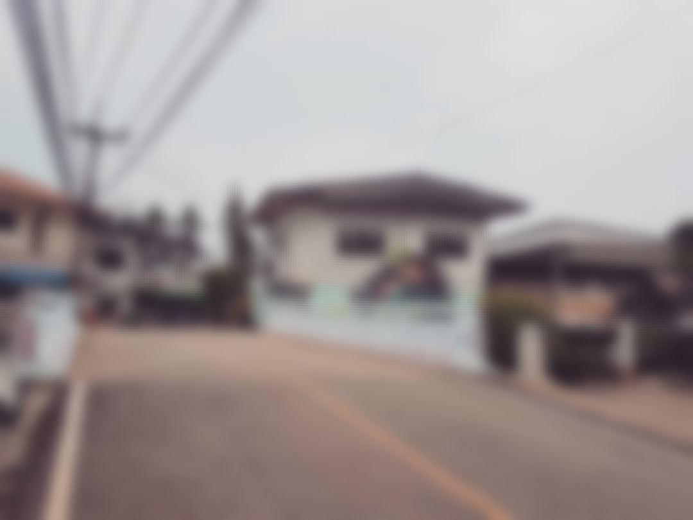
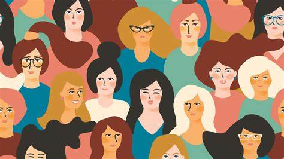

<!DOCTYPE html>
<html lang="en">
<head>
    <meta charset="UTF-8">
    <meta http-equiv="X-UA-Compatible" content="IE=edge">
    <meta name="viewport" content="width=device-width, initial-scale=1.0">
    <title>Portfolio</title>
    <link rel="stylesheet" href="styles/styles.css">
    <link rel="preconnect" href="https://fonts.googleapis.com">
    <link rel="preconnect" href="https://fonts.gstatic.com" crossorigin>
    <link rel="stylesheet" href="https://cdnjs.cloudflare.com/ajax/libs/font-awesome/5.15.4/css/all.min.css" integrity="sha512-1ycn6IcaQQ40/MKBW2W4Rhis/DbILU74C1vSrLJxCq57o941Ym01SwNsOMqvEBFlcgUa6xLiPY/NS5R+E6ztJQ==" crossorigin="anonymous" referrerpolicy="no-referrer" />
    <link href="https://fonts.googleapis.com/css2?family=Poppins:wght@400;500;600;700;800&display=swap" rel="stylesheet">
    
</head>
<body class="main-content">
    <header class="container header active" id="home">
       
       

            
        

        

        <h1 >Welcome, viewers!</h1>
    

         
         
         
         
         
        

            

                

                

                    
                

                
            

            

                <h1 class="name">
                    Hi, I'm Ariefiansyah Bagas Setiadi.
                    A Junior Web Developer.
                </h1>
                

                    I'm a Front-End Developer, Design Enthusiast, Junior Data Scientist, Aviation Enthusiast, Article Writer. I love to starting my journey into a new experience that I haven't tried before.
                    And I the person who loves any detail about my work. 
                

                

                    <a href="https://bit.ly/DownloadCVKu" class="main-btn">
                        Download CV
                        <i class="fas fa-download"></i>
                    </a>
                

            

        

    </header>
    <main>
        <section class="container about" id="about">
            

                <h2>About memy stats</h2>
            

            

                

                    <h4>Information About me</h4>
                    

                      Since I was born into a simple family, I've always had the determination to succeed, especially to make my family happy. In order to always learn something new, I like to take on challenges that are beyond my reach.
                    

                    

                        <a href="#" class="main-btn">
                            Download CV
                            <i class="fas fa-download"></i>
                        </a>
                    

                

                

                    

                        

                            
2

                            
Projects   Completed

                        

                    

                    

                        

                            
2

                            
Years of   experience

                        

                    

                    

                        

                            
High Accurate

                            
Data   Visualization

                        

                    

                    

                        

                            
2+

                            
Honest   reviews

                        

                    

                

            

            

                <h4 class="stat-title">My Skills</h4>
                

                    

                        
html5 & css3

                        

                            
Advanced

                            

                                
                            

                        

                    

                    

                        
Javascript

                        

                            
Intermediate

                            

                                
                            

                        

                    

                    

                        
Ubuntu Server Security

                        

                            
Beginner

                            

                                
                            

                        

                    

                    

                        
Python

                        

                            
Beginner

                            

                                
                            

                        

                    

                    

                        
Network Mapping

                        

                            
Advanced

                            

                                
                            

                        

                    

                    

                        
MikroTik

                        

                            
Advanced

                            

                                
                            

                        

                    

                

            

            <h4 class="stat-title">My Timeline</h4>
            

                

                    

                        <i class="fas fa-briefcase"></i>
                    

                    
2018 - 2021 

                    <h5>Computer and Network Engineering  - Travina Prima's Vocational Highschool</h5>
                    

                        Be one of the best students in the school for three consecutive years and be awarded a scholarship
                    

                

                

                    

                        <i class="fas fa-briefcase"></i>
                    

                    
2021

                    <h5>Product Identificator - Pitjarus Tech</h5>
                    

                        Work on AI in the retail industry to filter data for machine learning purposes.
                    

                

                

                    

                        <i class="fas fa-briefcase"></i>
                    

                    
2022 - present

                    <h5>Aviation Security  - Ministry of Transportation </h5>
                    

                        Be a part of the Ministry of Transportation in establishing, supervising, and maintaining airport security.
                    

                

                

                    

                        <i class="fas fa-briefcase"></i>
                    

                    
2022 - present

                    <h5>Article Writer - Perihalpuan </h5>
                    

                        Get involved in writing about emancipation and welfare of women, among other gender issues.
                    

                

            

        </section>
        <section class="container" id="portfolio">
            

                <h2>My PortfolioMy Work</h2>
            

            

                The following are some of the projects that I created during my foray into the digital world.
            

            

                

                    

                        
                    

                    

                        <h3> Zeal Shop Social  Media Marketing  </h3>
                        

                            <a href="https://bit.ly/ZealShopContact" class="icon">
                                <i class="fab fa-whatsapp"></i>
                            </a>
                           
                        

                    

                

                

                    

                        
                    

                    

                        <h3>Coming Soon</h3>
                        

                            <a href="#" class="icon">
                                <i class="fab fa-github"></i>
                            </a>
                            </a>
                        

                    

                

                

                    

                        
                    

                    

                        <h3>Coming Soon</h3>
                        

                            <a href="#" class="icon">
                                <i class="fab fa-github"></i>
                            </a>
                            </a>
                        

                    

                

                

                    

                        
                    

                    

                        <h3>Coming Soon</h3>
                        

                            <a href="#" class="icon">
                                <i class="fab fa-github"></i>
                            </a>
                         
                        

                    

                

                

                    

                        
                    

                    

                        <h3>Coming Soon</h3>
                        

                            <a href="#" class="icon">
                                <i class="fab fa-github"></i>
                            </a>
                          
                            </a>
                        

                    

                

                

                    

                        
                    

                    

                        <h3>Coming Soon</h3>
                        

                            <a href="#" class="icon">
                                <i class="fab fa-github"></i>
                            </a>
                           
                            </a>
                        

                    

                

                    

                

            

        </section>
        <section class="container" id="blogs">
            

                

                    <h2>My BlogsMy Blogs</h2>
                

                

                    

                        
                        

                            <h4>
                                Feminis di dalam pop Culture
                            </h4>
                            

                                Apakah menurutmu gerakan feminis di dalam pop culture itu berdampak? apa saja yang membuat hal tersebut dapat dibilang berdampak?
                            

                        

                    

                    

                        
                        

                            <h4>
                                Coming Soon!
                            </h4>
                            

                                ---
                            

                        

                    

                    

                        
                        

                            <h4>
                                Coming Soon!
                            </h4>
                            

                                ---
                            

                        

                    

                

            

        </section>
        <section class="container contact" id="contact">
            

                

                    <h2>Contact MeContact</h2>
                

                

                    

                        <h4>Contact me here</h4>
                        

                            If you have any questions about myself personally. Highly recommended to contact me below
                        

                        

                            

                                

                                    <i class="fas fa-map-marker-alt"></i>
                                    Location
                                

                                

                                    : Poso, Central Sulawesi
                                

                            

                            

                                

                                    <i class="fas fa-envelope"></i>
                                    Email
                                

                                

                                    : bagas.setiadi8@gmail.com (Important emails only)
                                

                            

                            

                                

                                    <i class="fas fa-user-graduate"></i>
                                    Education
                                

                                

                                    : Graduated from Vocational Highschool of Travina's Prima
                                

                            

                            

                                

                                    <i class="fas fa-user-graduate"></i>
                                    Mobile Number
                                

                                

                                    : 081513243666
                                

                            

                            

                                

                                    <i class="fas fa-globe-africa"></i>
                                    Languages
                                

                                

                                    : English, Indonesian, Thailand
                                

                            

                        

                        

                            

                                <a href="https://www.instagram.com/_ariefiansyah_" target="_blank">
                                    <i class="fab fa-instagram"></i>
                                </a>
            
                                <a href="https://www.linkedin.com/in/ariefiansyah-bagas-s-a610661b6/" target="_blank">
                                    <i class="fab fa-linkedin"></i>
                                </a>
                            

                        

                    

                   
                

            

        </section>
    </main>

    

        

            <i class="fas fa-home"></i>
        

        

            <i class="fas fa-user"></i>
        

        

            <i class="fas fa-briefcase"></i>
        

        

            <i class="far fa-newspaper"></i>
        

        

            <i class="fas fa-envelope-open"></i>
        

    

    

        <i class="fas fa-adjust"></i>
    

    
</body>
</html>
